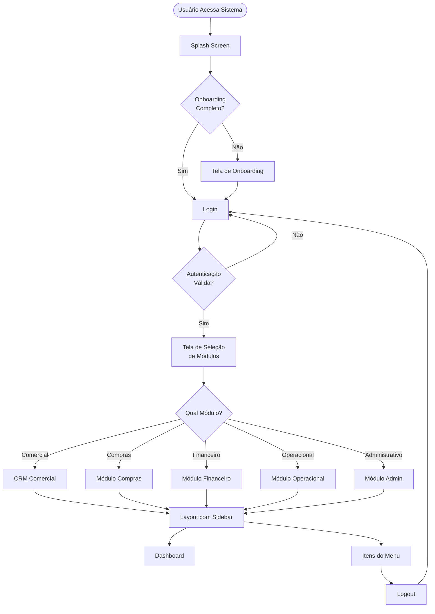
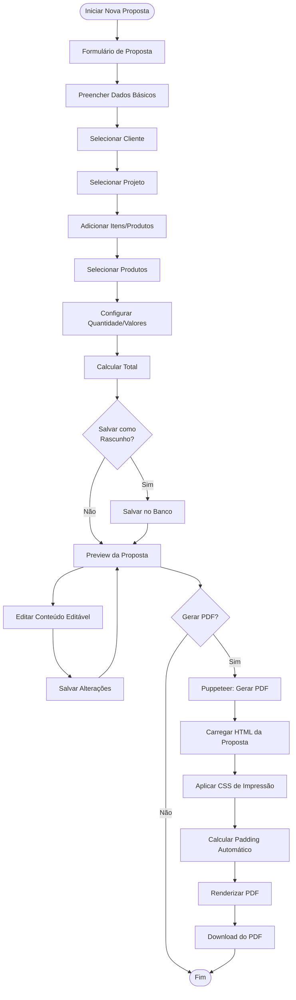
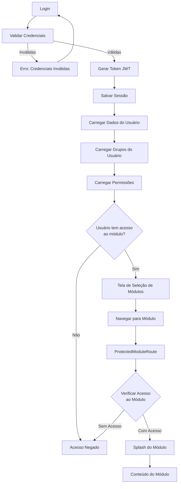
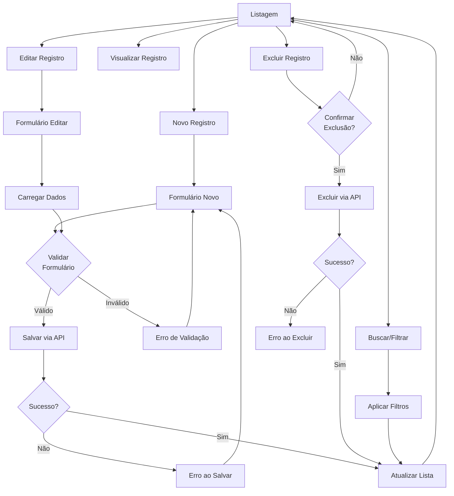
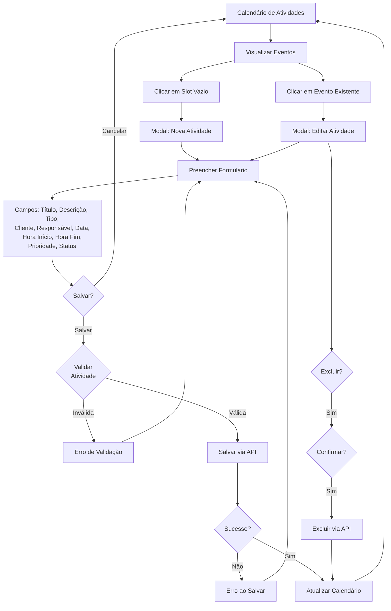
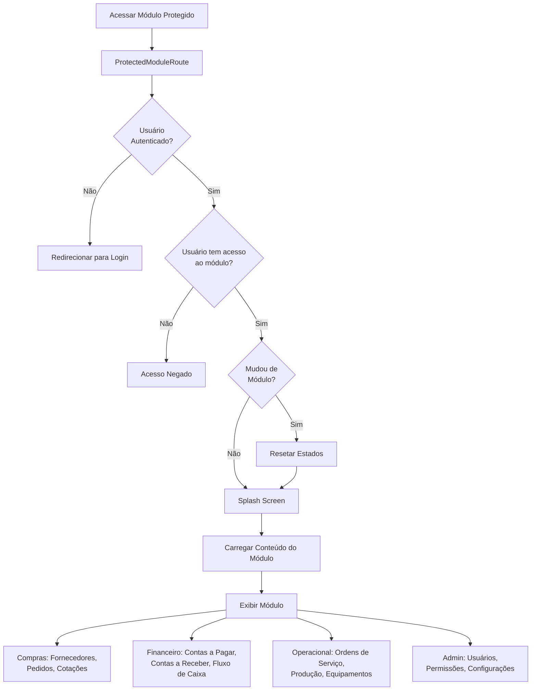
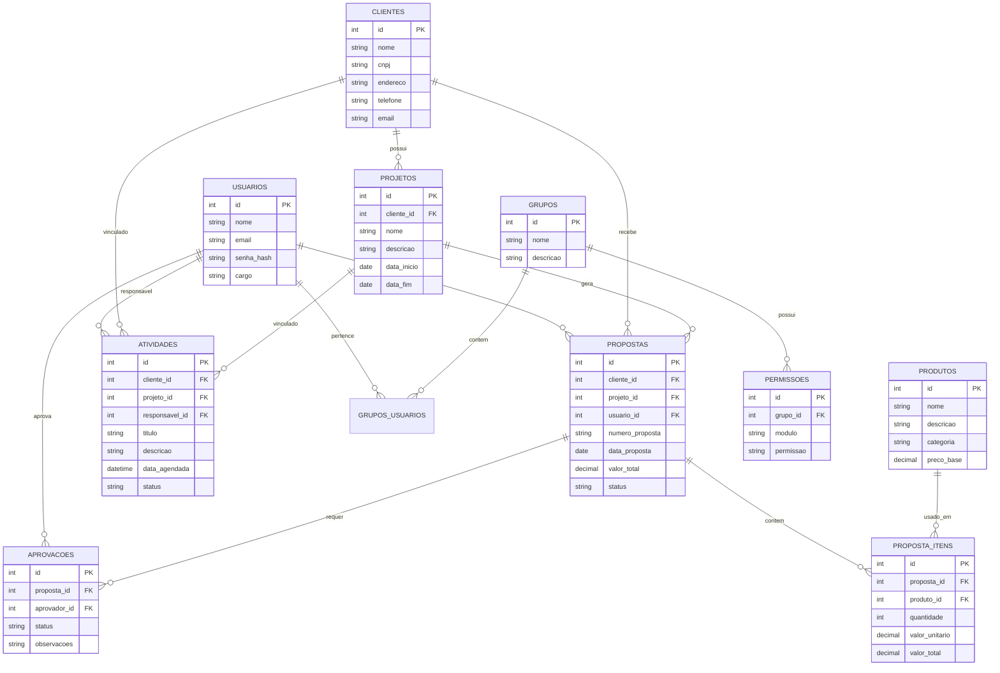
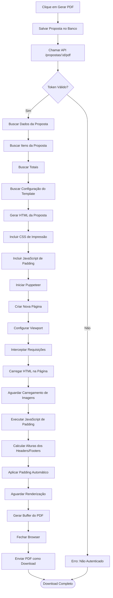
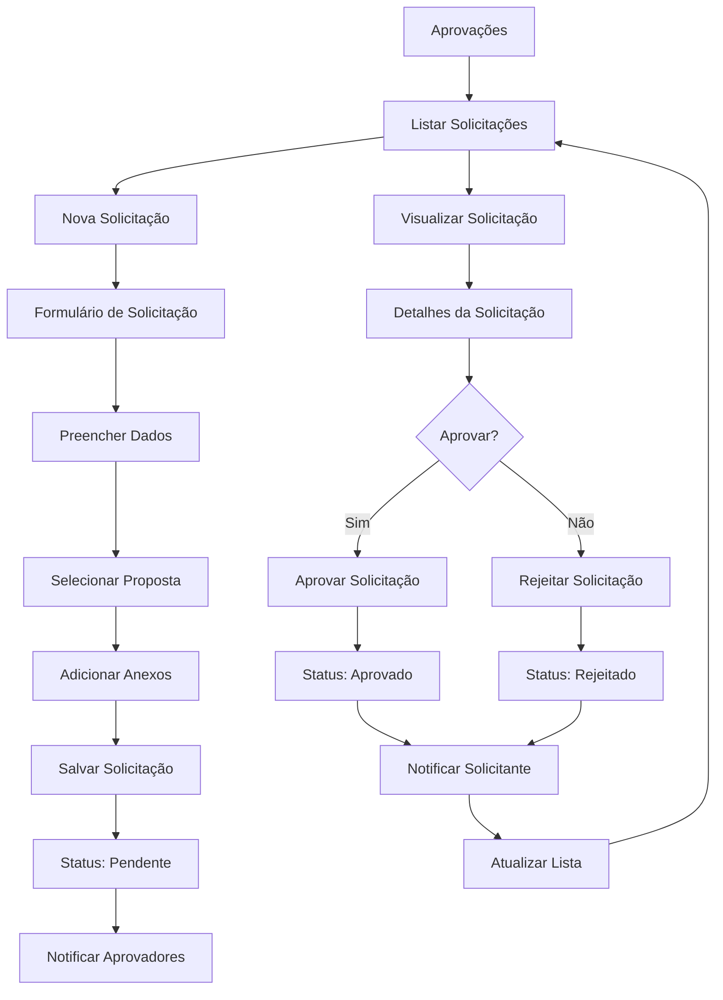

# Fluxograma do Sistema CRM GMP

## Visão Geral do Sistema

Este documento apresenta o fluxograma completo do sistema CRM GMP, mostrando os principais fluxos de navegação, autenticação, módulos e funcionalidades.

## 1. Fluxo Principal de Autenticação e Navegação

## 2. Fluxo do Módulo Comercial (CRM)

```mermaid
flowchart TD
    Comercial[CRM Comercial] --> Dashboard[Dashboard]
    
    Dashboard --> Clientes[Clientes]
    Dashboard --> Projetos[Projetos]
    Dashboard --> Propostas[Propostas]
    Dashboard --> Produtos[Produtos]
    Dashboard --> Atividades[Atividades]
    Dashboard --> Aprovacoes[Aprovações]
    Dashboard --> Relatorios[Relatórios]
    Dashboard --> MaquinasVendidas[Máquinas Vendidas]
    Dashboard --> CustosViagens[Custos de Viagens]
    
    Clientes --> ListClientes[Listar Clientes]
    Clientes --> NovoCliente[Novo Cliente]
    Clientes --> EditarCliente[Editar Cliente]
    
    Projetos --> ListProjetos[Listar Projetos]
    Projetos --> NovoProjeto[Novo Projeto]
    Projetos --> EditarProjeto[Editar Projeto]
    
    Propostas --> ListPropostas[Listar Propostas]
    Propostas --> NovaProposta[Nova Proposta]
    Propostas --> EditarProposta[Editar Proposta]
    Propostas --> PreviewProposta[Preview Proposta]
    Propostas --> GerarPDF[Gerar PDF]
    Propostas --> ConfigTemplate[Configurar Template]
    
    Produtos --> ListProdutos[Listar Produtos]
    Produtos --> NovoProduto[Novo Produto]
    Produtos --> EditarProduto[Editar Produto]
    
    Atividades --> Calendario[Calendário de Atividades]
    Calendario --> NovaAtividade[Nova Atividade]
    Calendario --> EditarAtividade[Editar Atividade]
    Calendario --> VincularCliente[Vincular Cliente]
    Calendario --> VincularResponsavel[Vincular Responsável]
    
    Aprovacoes --> ListAprovacoes[Listar Aprovações]
    Aprovacoes --> NovaSolicitacao[Nova Solicitação]
    Aprovacoes --> Aprovar[Aprovar/Rejeitar]
    
    Relatorios --> RelatorioVendas[Relatório de Vendas]
    Relatorios --> RelatorioClientes[Relatório de Clientes]
    Relatorios --> RelatorioPropostas[Relatório de Propostas]
    
    MaquinasVendidas --> MapaClientes[Mapa de Clientes]
    MaquinasVendidas --> KPICards[KPIs e Estatísticas]
    
    CustosViagens --> ListCustos[Listar Custos]
    CustosViagens --> NovoCusto[Novo Custo]
    CustosViagens --> UploadComprovante[Upload Comprovante]
```

## 3. Fluxo de Criação e Geração de Proposta

## 4. Fluxo de Autenticação e Permissões

## 5. Fluxo de CRUD Genérico (Clientes, Projetos, Produtos)

## 6. Fluxo de Atividades (Calendário)

## 7. Fluxo de Módulos Protegidos

## 8. Estrutura de Dados e Banco de Dados

## 9. Fluxo de Geração de PDF (Puppeteer)

## 10. Fluxo de Aprovações

## Legenda

- **Retângulos**: Processos/Ações
- **Losangos**: Decisões/Condições
- **Círculos**: Início/Fim
- **Setas**: Fluxo de execução

## Observações Importantes

1. **Autenticação**: Todo acesso requer autenticação via JWT
2. **Permissões**: Cada módulo verifica permissões do usuário antes de permitir acesso
3. **Propostas**: O fluxo de geração de PDF usa Puppeteer para renderização server-side
4. **Atividades**: Integração com calendário permite vinculação com clientes e responsáveis
5. **Módulos**: Sistema modular com proteção de rotas por módulo
6. **Banco de Dados**: SQLite com relacionamentos entre entidades principais

## Tecnologias Utilizadas

- **Frontend**: React, React Router, Context API
- **Backend**: Node.js, Express, SQLite
- **PDF**: Puppeteer
- **Autenticação**: JWT
- **Estilização**: CSS3, Animações, Dark Mode
